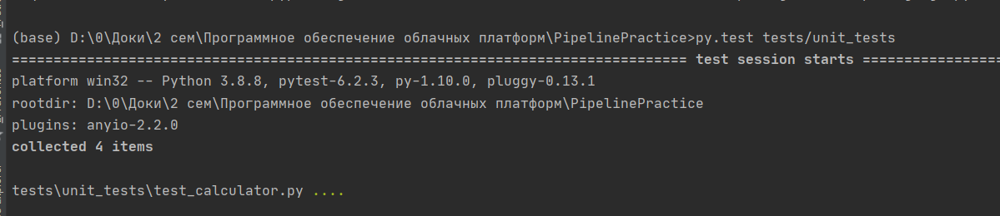
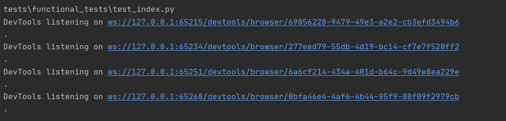
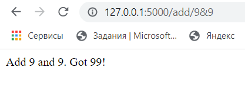
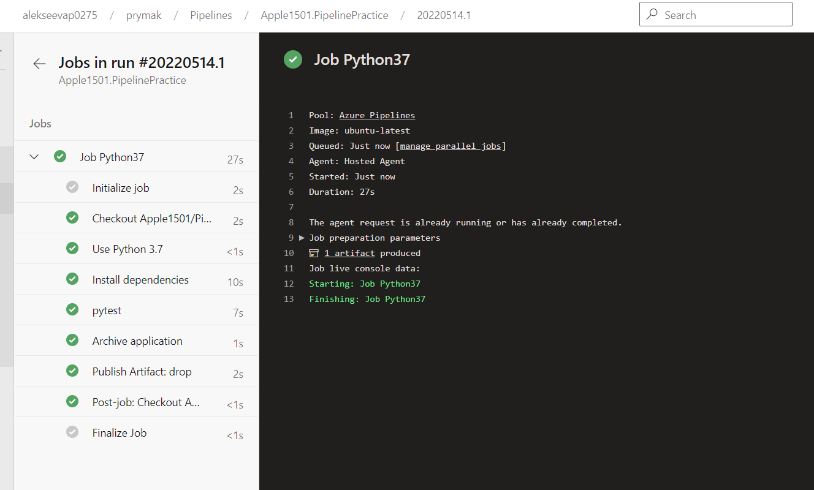
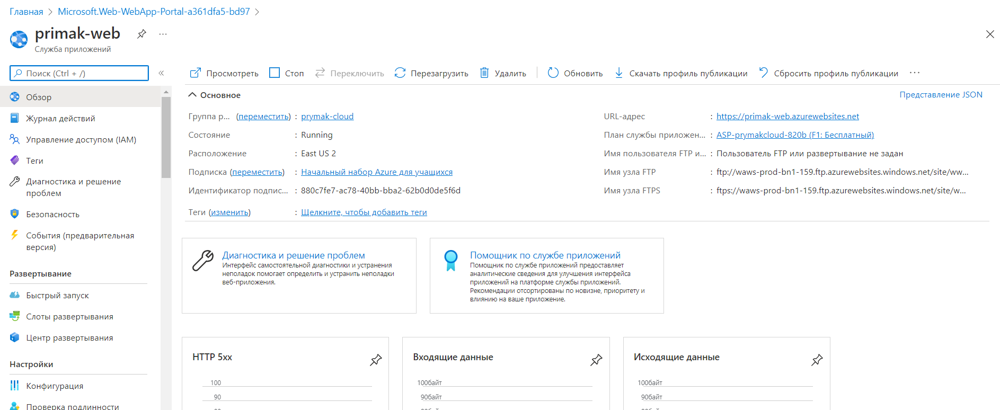

# Отчёт
Пример [статус бейджа](https://docs.microsoft.com/en-us/azure/devops/pipelines/create-first-pipeline?view=azure-devops&tabs=java%2Ctfs-2018-2%2Cbrowser) с пайплайна:

[](https://dev.azure.com/alekseevap0275/prymak/_build/latest?definitionId=3&branchName=master)

## Локальный запуск функциональных и юнит тестов

Для тестирование используется pytest модуль.

С помощью команды устанавливаем pytest:
```shell
   pip install pytest
 ```
Запускаем тестирование и проверяем, что всё работает.
 

После этого создаём ошибку в коде и убеждаемся, что один из тестов не пройдён.
 

Для функционального тестирования используем модуль selenium:

```shell
   pip install selenium
 ```
1. Скачиваем драйвер chrome и переносим его в папку с функциональными тестами
2. Запускаем приложение app.py
3. Запускаем тест с помощью команды:

```shell
  pytest tests/functional_tests
```
 

 

 

4. Меняем код и проверяем, что тест вылавливает ошибки

 

 

Ошибка найдена, тест не пройден.


## Pipeline - continuous integration (CI) with Azure DevOps

Настраиваем интеграцию с Azure DevOps

Создаём Pipeline. Переходим в пайплайн. Убеждаемся, что все stages выполнены

 

 

## Pipeline - continuous deployment (CD) with Azure DevOps

Создаём Web App в Azure

 

В Azure DevOps создаём Release

 

Проверяем работу: https://primak-web.azurewebsites.net/

 

Добавляем тесты в Release

 

В результате прохождения тестов и выпуска приложения репозиторий GitHub был отмечен зеленой галочкой

 