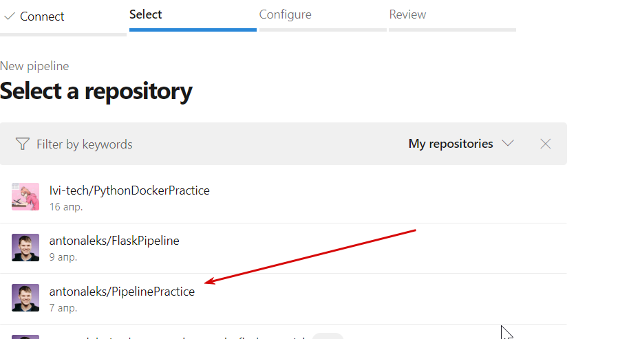

# Задание

## Юнит тестирование (локальный запуск тестов)

1. Для юнит тестирования кода используется unittest либо pytest модули
2. Продемонстрировать пример юнит тестирования с классом calculator (реализует просты математические операции)
    1. Использовать интерпритатор Python3.X, где X>6
    2. Установить с помощью команды pip зависимости pytest
   ```shell
   pip install pytest
   ```
    3. Запустить тесты с помщью команды
   ```shell
   py.test tests/unit_tests
   ```
    4. Убедиться, что тесты пройдены
    5. Также можно настроить Pycharm для запуска тестов через IDE:
       \
       Далее запускать через:
       
3. Продемонстрировать ошибки при тестировании кода
    1. В классе Calculator допустить ошибку в функции (например в функции add вместо + написать оператор -)
    2. Запустить тесты
    3. Убедиться, что один из тестов не пройден

## Функциональное тестирование (локальный запуск тестов)

1. Для функционального тестирования кода используется модуль selenium
   ```shell
   pip install selenium
   ```
2. Продемонстрировать пример функционального тестирования с мини приложением на flask, которое выдает результаты
   операций класса калькулятор
    1. Установить selenium (команда выше). Скачать необходимый драйвер (chrome или yandex) и вложить в папку с
       функциональными тестами. Если используете chrome, необходимо указать путь к драйверу в переменной chrome_driver (
       сейчас стоит к yandexdriver, если не задана переменная среды ChromeWebDriver)
       Если используете ОС Linux, то вместо exe необходимо скачать драйвер для Linux.
    2. Запустить веб-приложение. Оно должно запуститься на localhost:5000
   ```shell
   python app.py
   ``` 
    3. Запустить тесты
   ```shell
   py.test tests/functional_tests
   ```
    4. Убедиться, что тесты пройдены
3. Продемонстрировать ошибки при тестировании кода (неверный тип, неверная строка)
    1. В файле app.py в методе add убрать из ```@app.route("/add/<int:a>&<int:b>")``` тип **int** (python будет
       воспринимать a и b как строки)
       Должно получится ```@app.route("/add/<a>&<b>")```
    2. Запустить веб-приложение и тесты
    3. Убедиться, что один из тестов не прошел (при сложении получается конкатенация строк, а не арифметическая
       операция)

## Pipeline - continuous integration (CI) with Azure DevOps

1. Восстановить код до состояния, когда все тесты проходят успешно
2. Сделать git push изменений в свой репозиторий на GitHub
3. Настроить интеграцию с Azure DevOps
    1. Зайти на [сайт](https://dev.azure.com) Azure DevOps. Зайти под студенческим аккаунтом.
    2. Создать проект со своим именем (можно оставить дефолтные настройки). Проект сделать публичным.
       
    3. Добавить аккаунт преподавателя в свой проект
       \   
       
3. Создать CI pipeline
    1. Перейти во вкладку Pipelines
       
    2. Нажать кнопку create Pipeline
    3. Выбрать GitHub как источник кода
       
    4. Выбрать репозитори PipelinePractice
       
    5. В yaml файл (манифест) вставить следующий код:
    ```yaml
    # Python package
    # Create and test a Python package on multiple Python versions.
    # Add steps that analyze code, save the dist with the build record, publish to a PyPI-compatible index, and more:
    # https://docs.microsoft.com/azure/devops/pipelines/languages/python
    
    trigger: # в данном блоке определяется, при каком событии запускать пайплайн
    - master # запускаем, как только пришел новый коммит в ветку master
    
    pool: # здесь определяем образ докера, в котором запускается приложение и версию интерпритатора
      vmImage: ubuntu-latest # выбираем ubuntu
    strategy: # здесь выбираем стек программирования
      matrix: # matrix позволяет запускать параллельные конвейеры, если требуются разные версии
    #    Python36: # пока отключаем запуск на 3.6
    #      python.version: '3.6'
        Python37: # запускаем на 3.7
          python.version: '3.7'
    
    steps: # здесь указываются шаги конвейера
    - task: UsePythonVersion@0 # используем версию питона
      inputs:
        versionSpec: '$(python.version)'
      displayName: 'Use Python $(python.version)'
    
    - script: | # запускаем апдейт питона, устанавливаем зависимости (в нашем случае flask)
        python -m pip install --upgrade pip
        pip install -r requirements.txt
      displayName: 'Install dependencies' # здесь отображается название текущей задачи
    
    - script: | # запускаем юнит тесты
        pip install pytest 
        pytest tests/unit_tests && pip install pycmd && py.cleanup tests/
      displayName: 'pytest'
    
    - task: ArchiveFiles@2 # архивируем наш проект чтобы опубликовать артефакт. Артефакт это по сути то, что отдает клиенту (например архив с программой)
      displayName: 'Archive application'
      inputs:
        rootFolderOrFile: '$(System.DefaultWorkingDirectory)/'
        includeRootFolder: false
        archiveFile: '$(Build.ArtifactStagingDirectory)/$(Build.BuildId).zip'
    
    - task: PublishBuildArtifacts@1 # публикуем артефакт как результат нашего пайплайна
      displayName: 'Publish Artifact: drop'
    
   ```
   6. Нажимаем Run
4. Показать pipeline тестирования кода

[Статья пример](https://www.azuredevopslabs.com/labs/vstsextend/python/)