# Задание

## Юнит тестирование (локальный запуск тестов)

1. Для юнит тестирования кода используется unittest либо pytest модули
2. Продемонстрировать пример юнит тестирования с классом calculator (реализует просты математические операции)
    1. Использовать интерпритатор Python3.X, где X>6
    2. Установить с помощью команды pip зависимости pytest
   ```shell
   pip install pytest
   ```
    3. Запустить тесты с помщью команды
   ```shell
   py.test tests/unit_tests
   ```
    4. Убедиться, что тесты пройдены
    5. Также можно настроить Pycharm для запуска тестов через IDE:
       \
       Далее запускать через:
       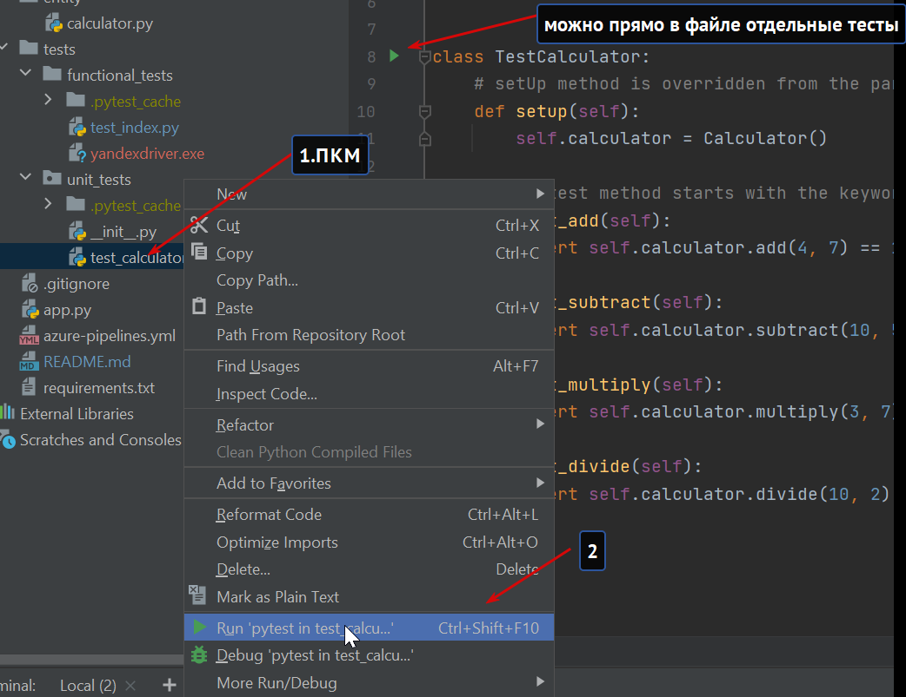
3. Продемонстрировать ошибки при тестировании кода
    1. В классе Calculator допустить ошибку в функции (например в функции add вместо + написать оператор -)
    2. Запустить тесты
    3. Убедиться, что один из тестов не пройден

## Функциональное тестирование (локальный запуск тестов)

1. Для функционального тестирования кода используется модуль selenium
   ```shell
   pip install selenium
   ```
2. Продемонстрировать пример функционального тестирования с мини приложением на flask, которое выдает результаты
   операций класса калькулятор
    1. Установить selenium (команда выше). Скачать необходимый драйвер (chrome или yandex) и вложить в папку с
       функциональными тестами. Если используете chrome, необходимо указать путь к драйверу в переменной chrome_driver (
       сейчас стоит к yandexdriver, если не задана переменная среды ChromeWebDriver)
       Если используете ОС Linux, то вместо exe необходимо скачать драйвер для Linux.
    2. Запустить веб-приложение. Оно должно запуститься на localhost:5000
   ```shell
   python app.py
   ``` 
    3. Запустить тесты
   ```shell
   py.test tests/functional_tests
   ```
    4. Убедиться, что тесты пройдены
3. Продемонстрировать ошибки при тестировании кода (неверный тип, неверная строка)
    1. В файле app.py в методе add убрать из ```@app.route("/add/<int:a>&<int:b>")``` тип **int** (python будет
       воспринимать a и b как строки)
       Должно получится ```@app.route("/add/<a>&<b>")```
    2. Запустить веб-приложение и тесты
    3. Убедиться, что один из тестов не прошел (при сложении получается конкатенация строк, а не арифметическая
       операция)

## Pipeline - continuous integration (CI) with Azure DevOps

1. Восстановить код до состояния, когда все тесты проходят успешно
2. Сделать git push изменений в свой репозиторий на GitHub
3. Настроить интеграцию с Azure DevOps
    1. Зайти на [сайт](https://dev.azure.com) Azure DevOps. Зайти под студенческим аккаунтом.
    2. Создать проект со своим именем (можно оставить дефолтные настройки). Проект сделать публичным.
       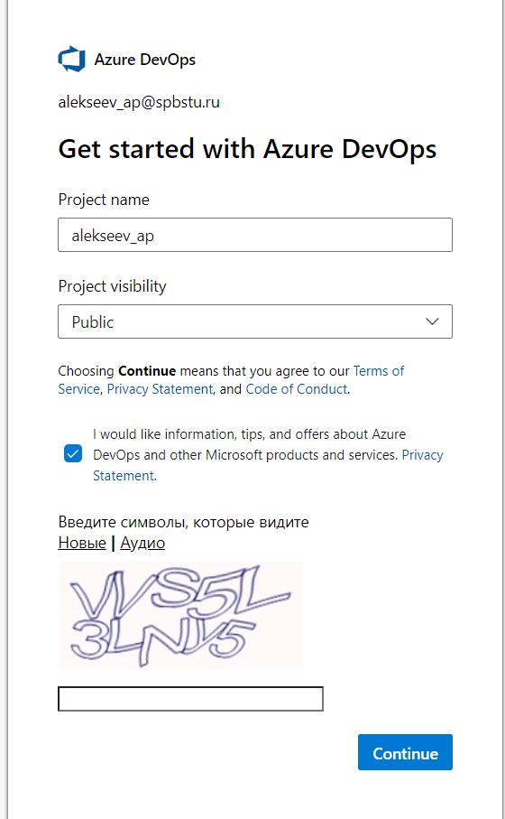
    3. Добавить аккаунт преподавателя в свой проект
       \   
       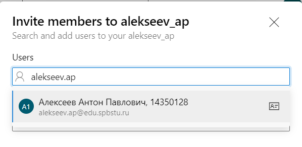
3. Создать CI pipeline
    1. Перейти во вкладку Pipelines
       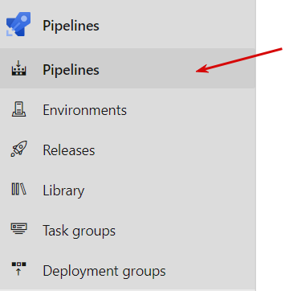
    2. Нажать кнопку create Pipeline
    3. Выбрать GitHub как источник кода (при этом нужно залогинится в свой аккаунт)
       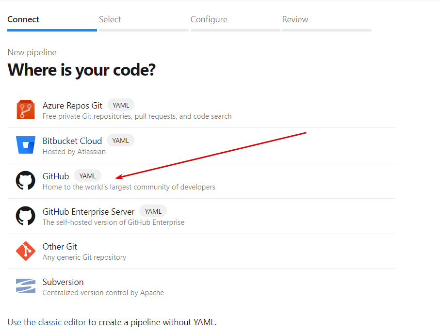
    4. Выбрать репозитори PipelinePractice
       
    5. В yaml файл (манифест) вставить следующий код:
    ```yaml
    # Python package
    # Create and test a Python package on multiple Python versions.
    # Add steps that analyze code, save the dist with the build record, publish to a PyPI-compatible index, and more:
    # https://docs.microsoft.com/azure/devops/pipelines/languages/python
    
    trigger: # в данном блоке определяется, при каком событии запускать пайплайн
    - master # запускаем, как только пришел новый коммит в ветку master
    
    pool: # здесь определяем образ докера, в котором запускается приложение и версию интерпритатора
      vmImage: ubuntu-latest # выбираем ubuntu
    strategy: # здесь выбираем стек программирования
      matrix: # matrix позволяет запускать параллельные конвейеры, если требуются разные версии
    #    Python36: # пока отключаем запуск на 3.6
    #      python.version: '3.6'
        Python37: # запускаем на 3.7
          python.version: '3.7'
    
    steps: # здесь указываются шаги конвейера
    - task: UsePythonVersion@0 # используем версию питона
      inputs:
        versionSpec: '$(python.version)'
      displayName: 'Use Python $(python.version)'
    
    - script: | # запускаем апдейт питона, устанавливаем зависимости (в нашем случае flask)
        python -m pip install --upgrade pip
        pip install -r requirements.txt
      displayName: 'Install dependencies' # здесь отображается название текущей задачи
    
    - script: | # запускаем юнит тесты (без функциональных)
        pip install pytest 
        pytest tests/unit_tests && pip install pycmd && py.cleanup tests/
      displayName: 'pytest'
    
    - task: ArchiveFiles@2 # архивируем наш проект чтобы опубликовать артефакт. Артефакт это по сути то, что отдает клиенту (например архив с программой)
      displayName: 'Archive application'
      inputs:
        rootFolderOrFile: '$(System.DefaultWorkingDirectory)/'
        includeRootFolder: false
        archiveFile: '$(Build.ArtifactStagingDirectory)/$(Build.BuildId).zip'
    
    - task: PublishBuildArtifacts@1 # публикуем артефакт как результат нашего пайплайна
      displayName: 'Publish Artifact: drop'
    
   ```
    6. Нажимаем Run. Переходим в пайплайн. Убеждаемся, что все stages выполнены
       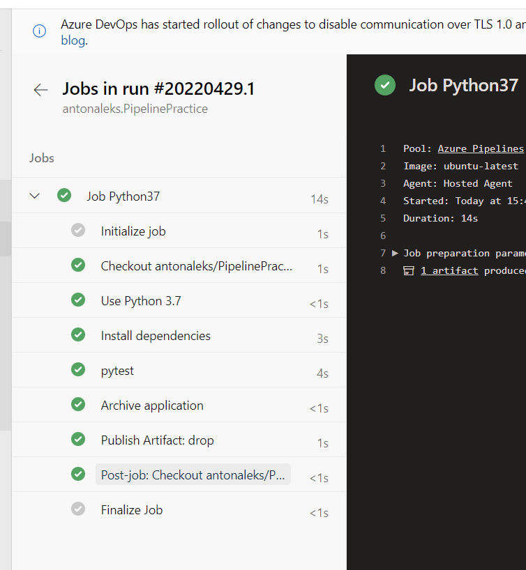
    7. Должен быть опубликован артефакт
       
       Название артефакта - версия
       

    8. В readme добавить status badge
       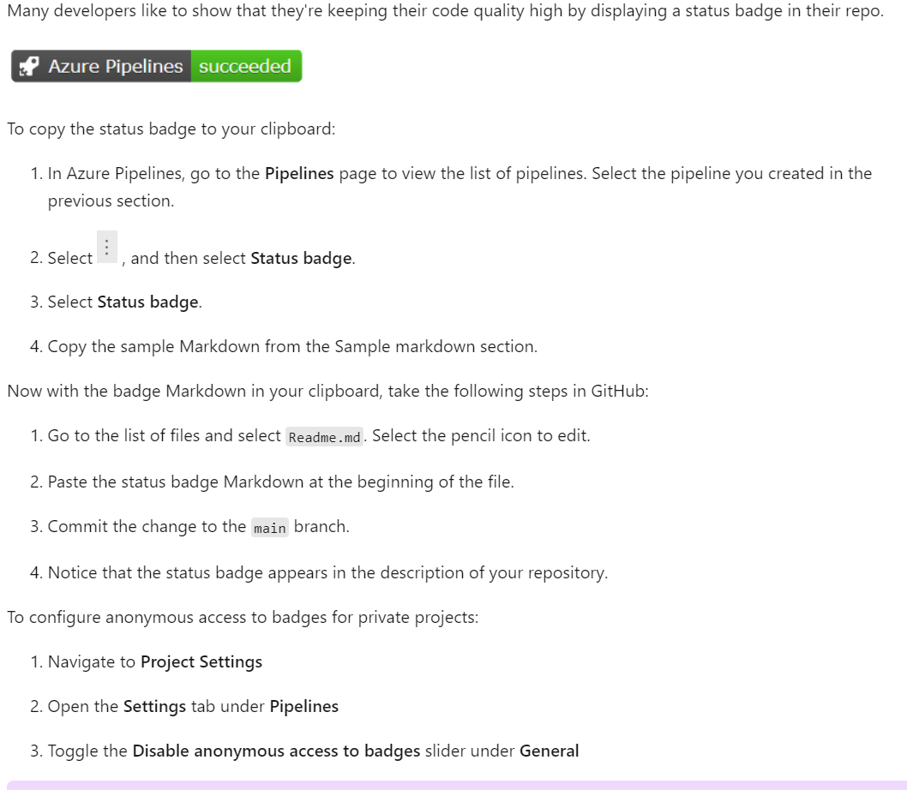

## Pipeline - continuous deployment (CD) with Azure DevOps

1. Восстановить код до состояния, когда все тесты проходят успешно
2. Запросить у преподавателя создание ресурсной группы в Azure
3. Создать Web App в Azure
    1. Войти в Azure с помощью своего университетского аккаунта
    2. Убедиться, что вам доступны ресурсы
    3. Создать новый ресурс
       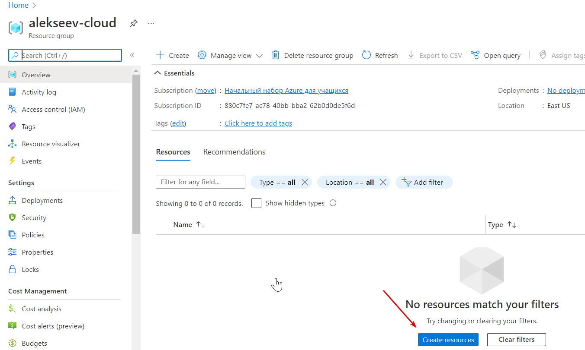
    4. Выбрать create web app
       
    5. Выбрать следующие характеристики
       
       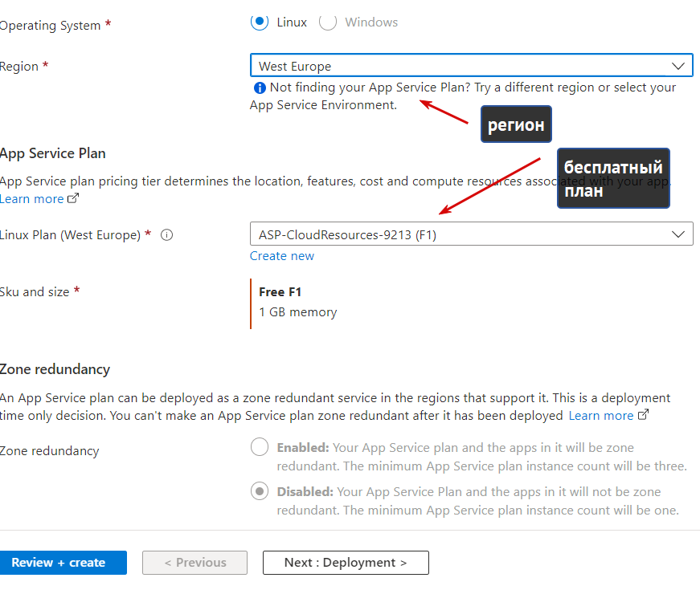
    6. Создать Web App
4. Настроить CD pipeline
    1. В Azure DevOps создать Release
       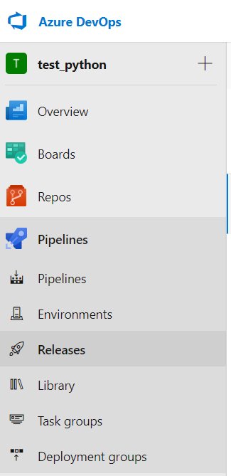
    2. В артефакты добавить результат pipeline из CI конвейра
       
       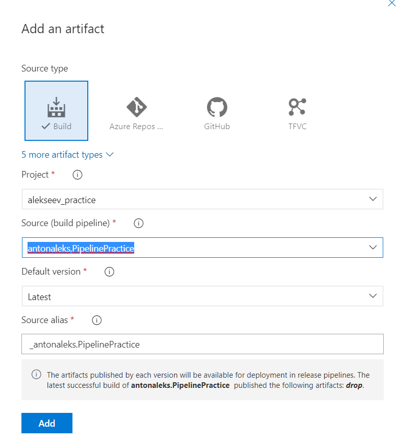
    3. Выставить тригер на запуск после CI пайплайна
       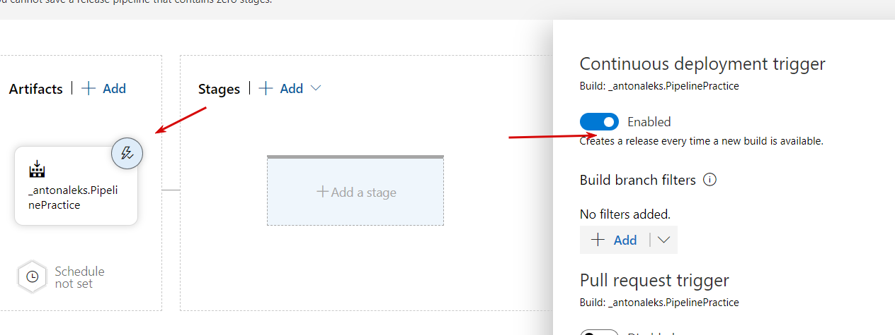
    4. Добавить Stage. Выбрать python app. Stage назвать deploy
       
    5. Удалить все stages. Добавить Azure App Service Deploy
       
    6. Сконфигурировать настройки сервиса в Azure
       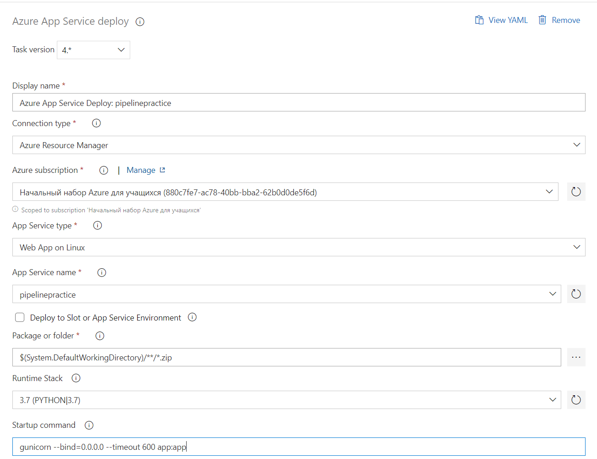
    ```shell
    gunicorn --bind=0.0.0.0 --timeout 600 app:app # команда вызова python app.py через шлюз gunicorn
    ```
   про gunicorn подробнее [здесь](https://docs.microsoft.com/en-us/azure/app-service/configure-language-python) - в
   поиске ищите gunicorn
    7. Убедиться, что агент запускается на Windows
       
    8. Нажать Create release
       
       
    9. Перейти на вкладку Release и нажать deploy
       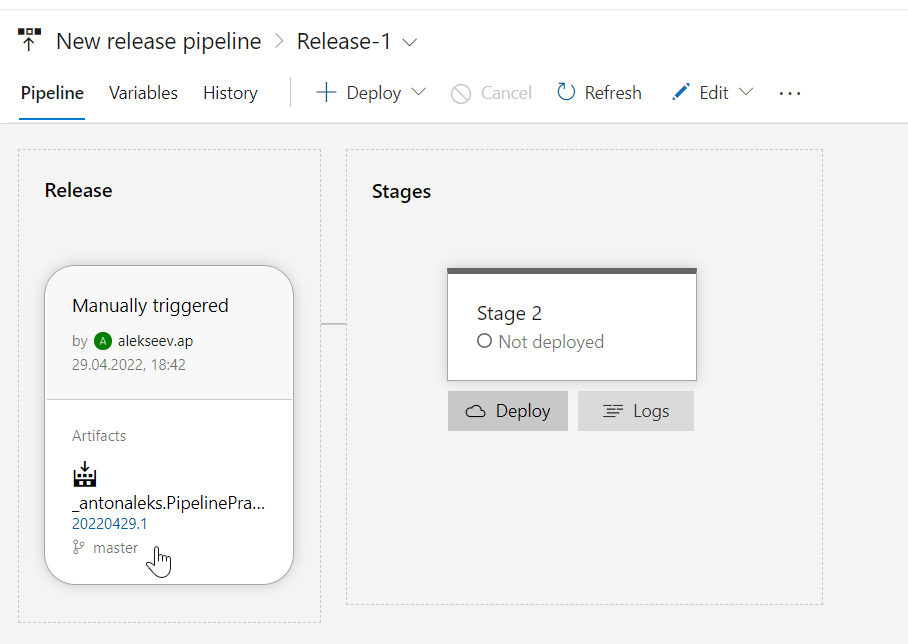
    10. Убедится, что все таски завершены
        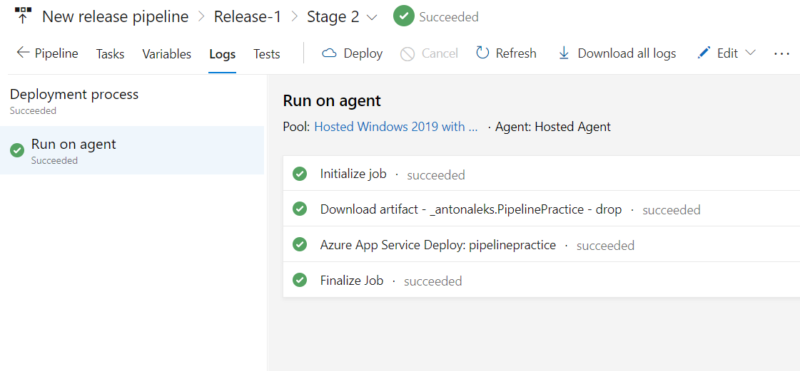
        11. Перейти на сайт по url, который задавали в Web App, должно отобразится hello-word
4. В CD pipeline настроить функциональное тестирование
    1. В Azure DevOps отредактировать Release. Добавить новый Stage. Назвать его test
       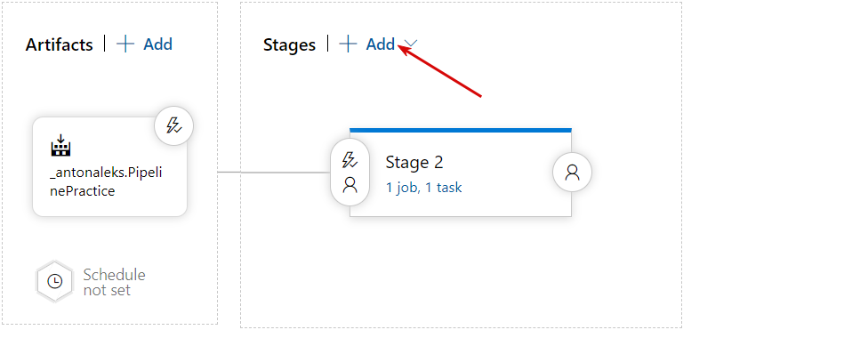
    2. Назначить его после stage с deploy
       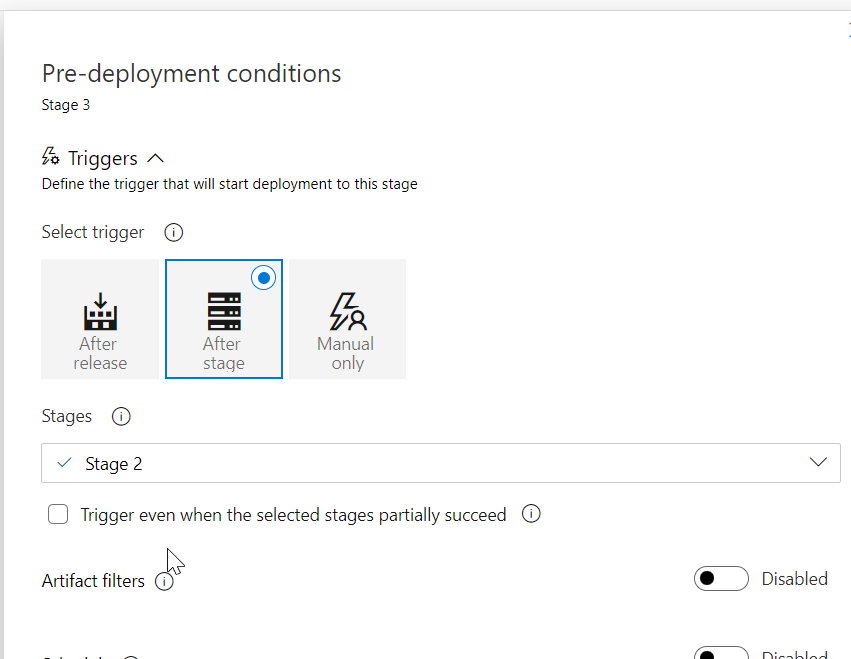
       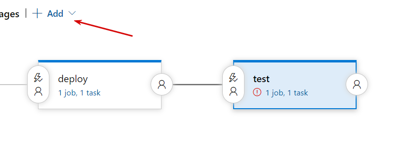
    3. Добавить следующие шаги:
       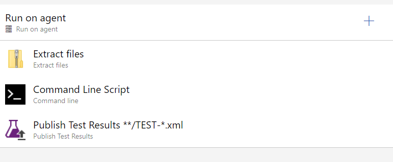
    4.Сконфигурировать следующим образом Разархивируем приложение (артефакт)
    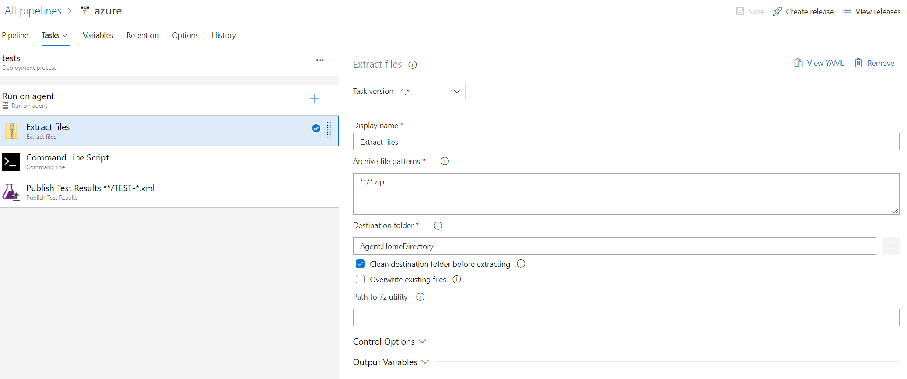

    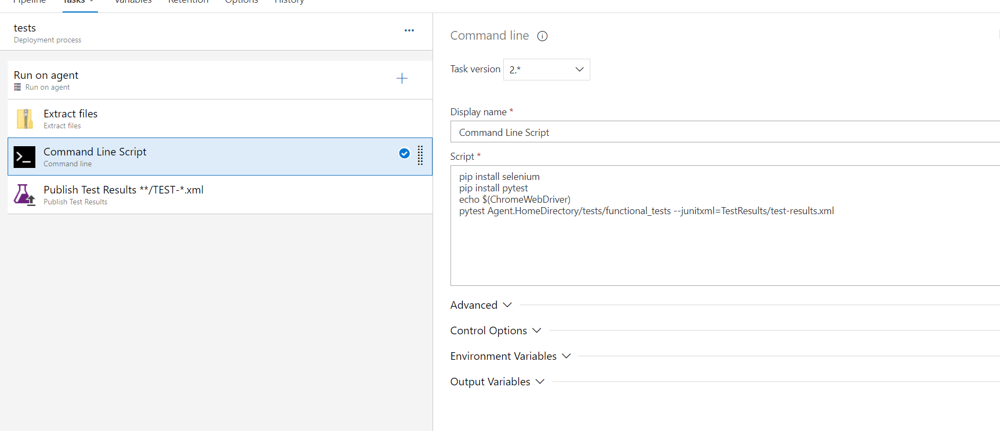
    Что происходит в коде?
    ```shell
      pip install selenium pytest# устанавливаем selenium и pytest
      echo $(ChromeWebDriver) # убеждаемся, что установлен ChromeWebDriver. Он есть только в версиях agent Windows
      pytest Agent.HomeDirectory/tests/functional_tests --junitxml=TestResults/test-results.xml # запускаем тесты. экспортируем отчет
    ```
   Публикуем тесты в Azure DevOps
   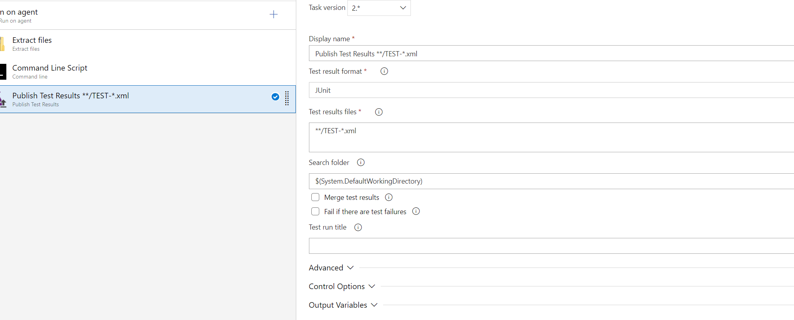
   5. Создать Release. Проверить, что тесты выполнились
   [Статья пример](https://www.azuredevopslabs.com/labs/vstsextend/python/)