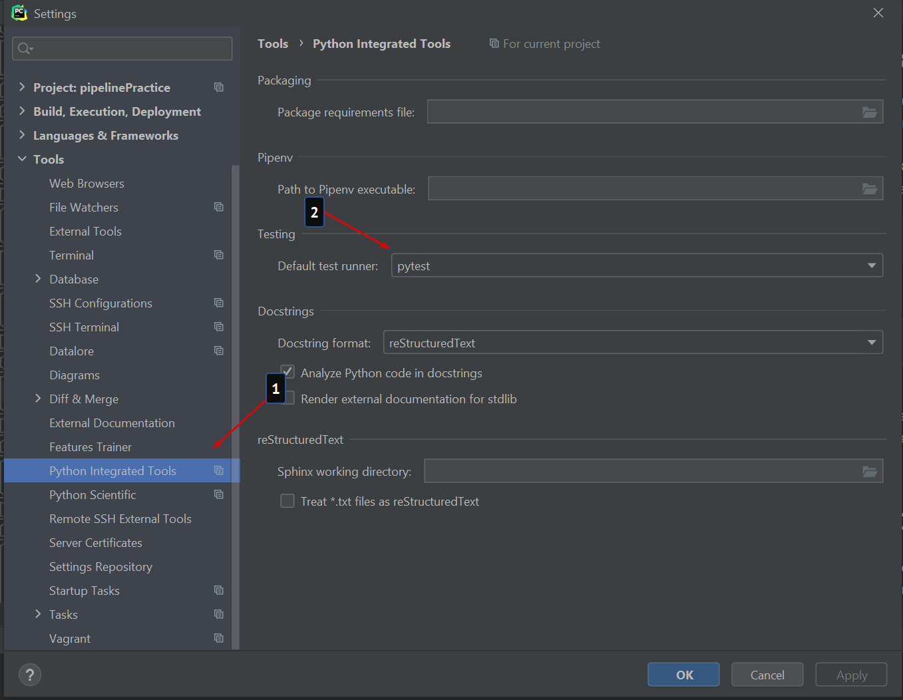

# Задание
## Юнит тестирование (локальный запуск тестов)
1. Для юнит тестирования кода используется unittest либо pytest модули
2. Продемонстрировать пример юнит тестирования с классом calculator (реализует просты математические операции)
   1. Использовать интерпритатор Python3.X, где X>6
   2. Установить с помощью команды pip зависимости pytest
   ```shell
   pip install pytest
   ```
   3. Запустить тесты с помщью команды
   ```shell
   py.test tests/unit_tests
   ```
   4. Убедиться, что тесты пройдены
   5. Также можно настроить Pycharm для запуска тестов через IDE:
   \
   Далее запускать через:
   
3. Продемонстрировать ошибки при тестировании кода
   1. В классе Calculator допустить ошибку в функции (например в функции add вместо + написать оператор -)
   2. Запустить тесты
   3. Убедиться, что один из тестов не пройден
## Функциональное тестирование (локальный запуск тестов)
1. Для функционального тестирования кода используется модуль selenium
   ```shell
   pip install selenium
   ```
2. Продемонстрировать пример функционального тестирования с мини приложением на flask, которое выдает результаты операций класса калькулятор
   1. Установить selenium (команда выше). Скачать необходимый драйвер (chrome или yandex) и вложить в папку с функциональными тестами.
   Если используете chrome, необходимо указать путь к драйверу в переменной chrome_driver (сейчас стоит к yandexdriver, если не задана переменная среды ChromeWebDriver)
      Если используете ОС Linux, то вместо exe необходимо скачать драйвер для Linux.
   2. Запустить веб-приложение. Оно должно запуститься на localhost:5000
   ```shell
   python app.py
   ``` 
   3. Запустить тесты   
   ```shell
   py.test tests/functional_tests
   ```
   4. Убедиться, что тесты пройдены
3. Продемонстрировать ошибки при тестировании кода (неверный тип, неверная строка)
   1. В файле app.py в методе add убрать из ```@app.route("/add/<int:a>&<int:b>")``` тип **int** (python будет воспринимать a и b как строки)
      Должно получится ```@app.route("/add/<a>&<b>")```
   2. Запустить веб-приложение и тесты
   3. Убедиться, что один из тестов не прошел (при сложении получается конкатенация строк, а не арифметическая операция)
## Pipeline - continuous integration (CI) with Azure DevOps
1. Восстановить код до состояния, когда все тесты проходят успешно
2. Сделать git push изменений в свой репозиторий на GitHub
3. Настроить интеграцию с Azure DevOps
   1. Зайти на [сайт](https://dev.azure.com) Azure DevOps. Зайти под студенческим аккаунтом
3. Показать pipeline сборки
   1. azure devops работает с pytest только
4. Показать pipeline тестирования кода

[Статья пример](https://www.azuredevopslabs.com/labs/vstsextend/python/)